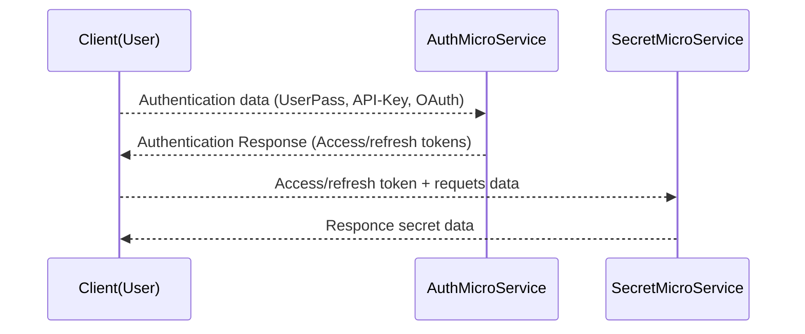
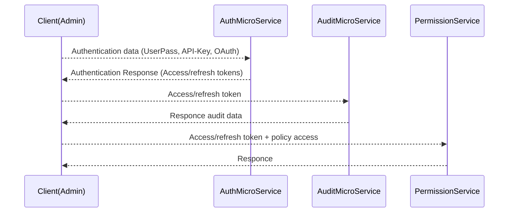

# GreenTeam

```mermaid
sequenceDiagram
Client(User) -->> AuthMicroService: Authentication data (UserPass, API-Key, OAuth)
AuthMicroService -->> Client(User): Authentication Response (Access/refresh tokens)
Client(User) -->> SecretMicroService: Access/refresh token + requets data
SecretMicroService -->> Client(User): Responce secret data
```

```mermaid
sequenceDiagram
Client(Admin) -->> AuthMicroService: Authentication data (UserPass, API-Key, OAuth)
AuthMicroService -->> Client(Admin): Authentication Response (Access/refresh tokens)
Client(Admin) -->> AuditMicroService: Access/refresh token
AuditMicroService -->> Client(Admin): Responce audit data
Client(Admin) -->> PermissionService: Access/refresh token + policy access
PermissionService -->> Client(Admin): Responce
```
## C4 - Component

## Электронная подпись

